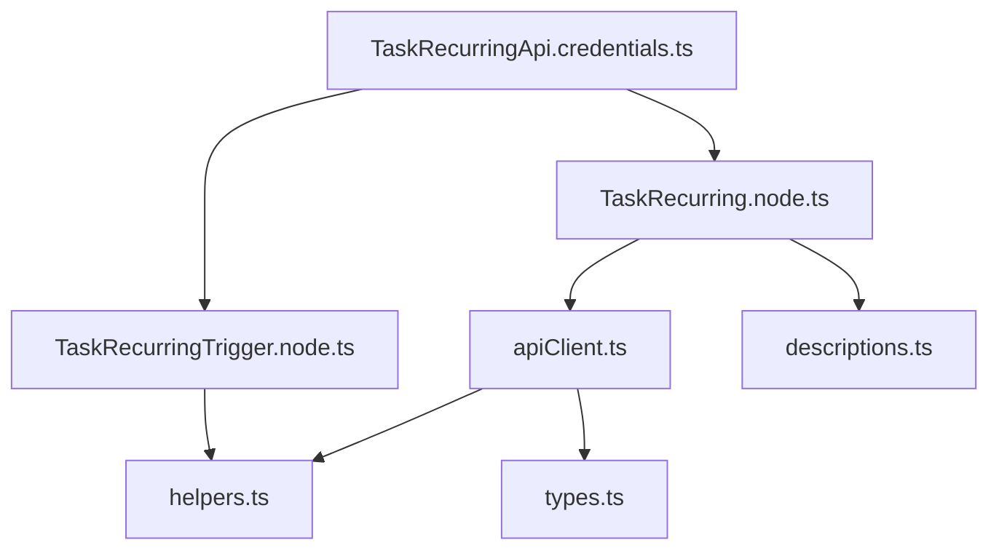
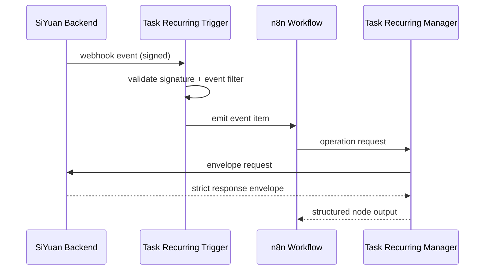

# n8n-nodes-task-recurring-notification

Production-ready n8n community node package for integrating **SiYuan Task Recurring Notification Management** with n8n v1+.

## Features

- **Action Node**: `Task Recurring Manager`
  - Create Task
  - Update Task
  - Complete Task
  - Delete Task
  - Get Task
  - List Tasks (with pagination/date/tag/status filters)
  - Trigger Recurrence
  - Add Reminder
- **Trigger Node**: `Task Recurring Trigger`
  - On Task Created
  - On Task Completed
  - On Recurring Executed
  - On Reminder Fired
- Typed credential model with API key / bearer token
- Optional HMAC signature generation and validation
- Continue-on-fail and batch-safe item handling

## Installation

```bash
npm i n8n-nodes-task-recurring-notification
```

For local development:

```bash
cd n8n-nodes-task-recurring-notification
npm install
npm run build
npm link
# in your n8n environment
npm link n8n-nodes-task-recurring-notification
```

## Credentials

Credential type: `Task Recurring API`

Fields:

- Base URL (example: `http://localhost:6806`)
- API Key
- Auth Mode (`API Key Header` or `Bearer Token`)
- Secret (optional, HMAC signing/verification)
- Workspace ID (optional)

Credential test endpoint:

- `GET /api/health`

## Webhook Setup

1. Add `Task Recurring Trigger` node to workflow.
2. Select desired events.
3. Activate workflow.
4. Node automatically calls backend registration endpoint:
   - `POST /api/webhooks/register`
5. On deactivation it unregisters:
   - `POST /api/webhooks/unregister`

### Handshake Validation

If request payload contains `{ "type": "handshake", "challenge": "..." }`, the trigger returns:

```json
{
  "success": true,
  "challenge": "..."
}
```

### Signature Verification

Expected incoming header:

- `X-Task-Signature`: `sha256` HMAC of the raw JSON payload using configured secret.

## API Contract

### Request envelope (strict)

```json
{
  "eventId": "string",
  "timestamp": "ISO-8601",
  "source": "n8n",
  "operation": "createTask",
  "data": {}
}
```

### Response envelope (strict)

```json
{
  "success": true,
  "data": {},
  "error": ""
}
```

### Expected backend endpoints

- `POST /api/tasks`
- `GET /api/tasks/:id`
- `PUT /api/tasks/:id`
- `DELETE /api/tasks/:id`
- `POST /api/tasks/:id/complete`
- `GET /api/tasks`
- `POST /api/tasks/:id/reminders`
- `POST /api/recurrence/trigger`
- `POST /api/webhooks/register`
- `POST /api/webhooks/unregister`
- `GET /api/health`

## Example Workflow

See: `examples/task-recurring-example-workflow.json`

## Security Notes

- Always use HTTPS in production.
- Rotate API keys and webhook secret regularly.
- Reject unsigned webhooks when secret is configured.
- Use network allow-listing on the SiYuan backend where possible.

## Compatibility Matrix

| Package | Supported |
|---|---|
| n8n | v1+ |
| node.js | >= 18.17 |
| Task Recurring backend | API contract documented above |

## Dependency Diagram



## Event Flow Diagram



## Error Handling Matrix

| Scenario | Node behavior |
|---|---|
| 401 Unauthorized | `NodeApiError` with request context |
| 403 Forbidden | `NodeApiError` |
| 404 Not Found | `NodeApiError` |
| 500+ Server Error | Retries up to `Retry Count`, then `NodeApiError` |
| Timeout | Retry then fail with `NodeApiError` |
| Network failure | Retry then fail with `NodeApiError` |
| API success=false | `NodeOperationError` with API error message |
| continueOnFail enabled | returns `{ success: false, error }` per item |

## Testing Checklist

- [ ] `npm run build` passes
- [ ] `npm link` completed for package
- [ ] Node appears in n8n UI under community nodes
- [ ] Credential test button succeeds
- [ ] Trigger registers/unregisters webhook on workflow activate/deactivate
- [ ] Create Task operation returns `success=true`
- [ ] Trigger signature validation works with valid and invalid signatures

## Future Enhancements

- Dynamic dropdown (`loadOptions`) per workspace and tag
- Batch create/update endpoints
- AI enrichment operation for task metadata
- Cursor-based pagination
- Webhook replay-attack protection using nonce store
